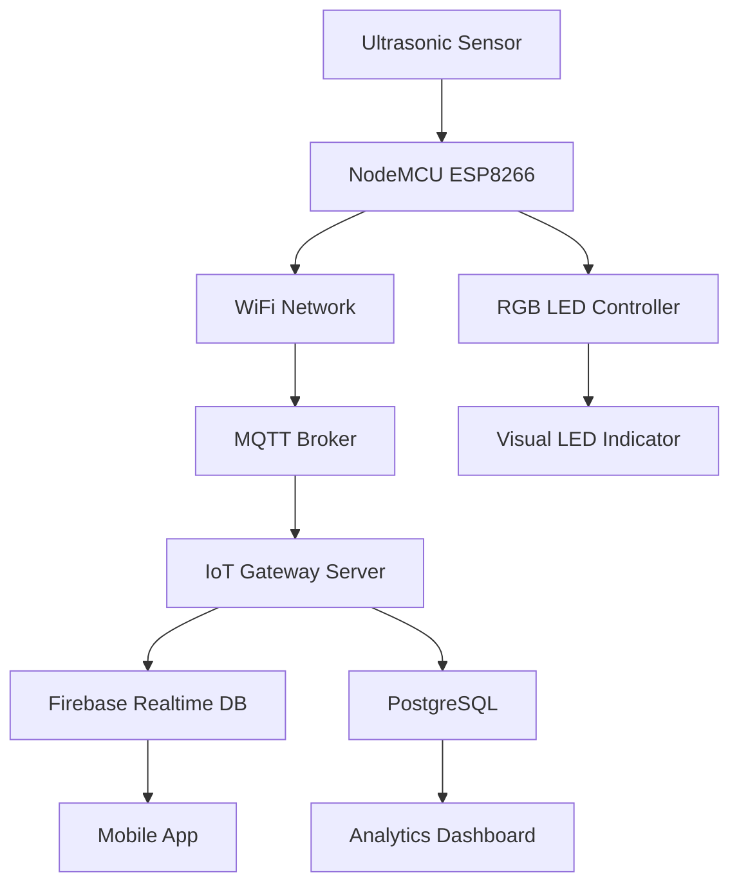
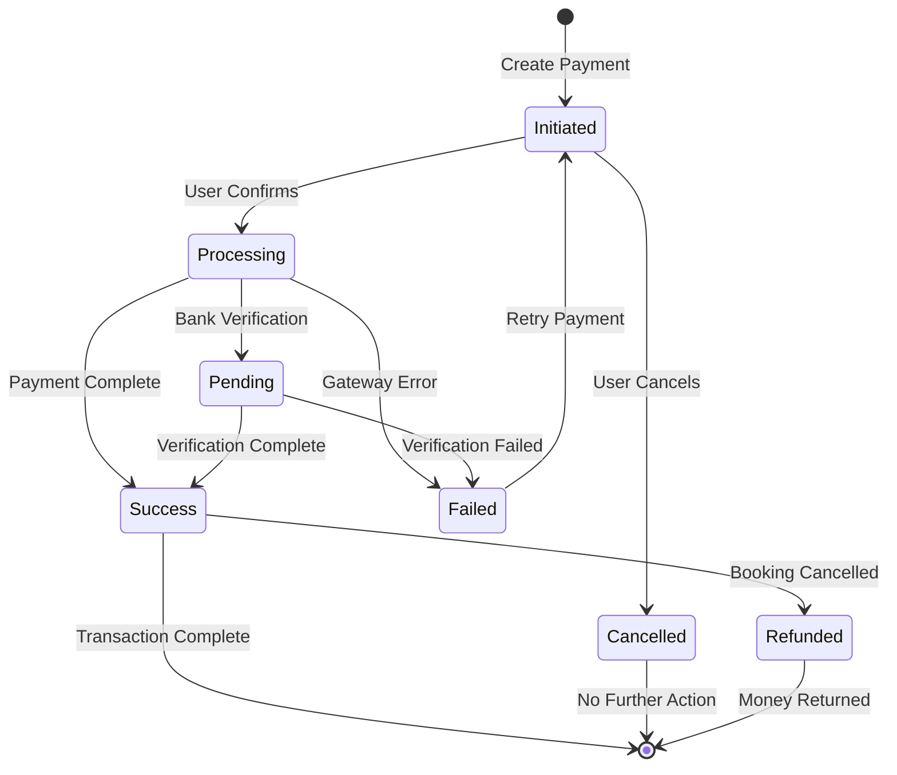
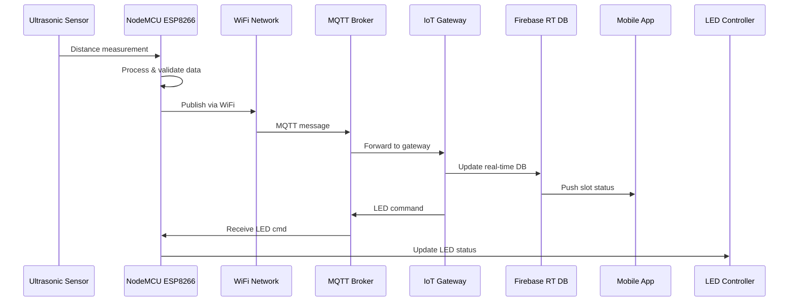

# ParkInToday Smart Parking System - Product Requirements Document

## Document Information
- **Version:** 1.0
- **Date:** September 6, 2025
- **Product Name:** ParkInToday
- **Document Type:** Product Requirements Document (PRD)

---

# 1. Executive Summary

## Product Description
ParkInToday is a comprehensive smart parking ecosystem that combines a mobile application, IoT sensor network, ANPR (Automatic Number Plate Recognition) cameras, and real-time payment processing to revolutionize urban parking experiences. The system provides real-time parking slot availability, advance booking capabilities, automated entry/exit management, and seamless payment processing.

## Problem Statement
Urban parking suffers from inefficiencies including:
- No real-time visibility of available parking slots
- Time wasted searching for parking spaces
- Manual payment processes causing delays
- Lack of advance booking options
- Poor utilization of existing parking infrastructure
- Inconsistent pricing and payment methods

## Vision & Goals
**Vision:** To create the most efficient, user-friendly, and technology-driven parking solution that eliminates parking-related stress and maximizes space utilization.

**Primary Goals:**
- Reduce parking search time by 80%
- Achieve 95% parking space utilization efficiency
- Provide seamless booking-to-exit experience in under 2 minutes
- Enable parking lot operators to increase revenue by 30%

## Target Audience
- **B2C:** Urban drivers, daily commuters, occasional parkers
- **B2B:** Parking lot operators, commercial building managers, municipal authorities

---

# 2. Objectives

## High-Level Product Goals
1. **User Experience Excellence:** Deliver intuitive mobile experience with sub-3-second app response times
2. **Operational Efficiency:** Automate 90% of parking operations through IoT and ANPR integration
3. **Revenue Optimization:** Maximize parking lot revenue through dynamic pricing and utilization analytics
4. **Scalability:** Support 1000+ parking slots per location with 99.9% system uptime
5. **Market Leadership:** Become the preferred smart parking solution in target markets

## Key Problems Solved
- **Real-time Availability:** Live slot status updates via IoT sensors
- **Advance Booking:** Reserve slots up to 24 hours in advance
- **Contactless Experience:** Automated entry/exit via ANPR technology
- **Unified Payments:** Single wallet system with multiple payment options
- **Navigation Integration:** Turn-by-turn directions to reserved slots
- **Operator Analytics:** Comprehensive dashboard for business intelligence

---

# 3. Scope

## In-Scope Features
### Core Mobile Application
- User authentication and profile management
- Real-time parking lot discovery within 3km radius
- Interactive slot selection with visual lot layouts
- Advance booking with 1-hour grace period
- Integrated navigation and route optimization
- Multi-payment gateway support with custom wallet
- Booking history and transaction management
- Push notifications for all key events

### IoT Infrastructure
- Ultrasonic sensor network for slot occupancy detection
- RGB LED visual indicators (red/green status)
- NodeMCU ESP8266 microcontroller integration
- Real-time database synchronization
- Offline backup and auto-recovery systems

### ANPR System
- High-resolution camera installation at entry/exit points
- Machine learning-based license plate recognition
- Automated boom barrier control
- Booking verification and timer management
- Manual override capabilities for security

### Backend Services
- RESTful API architecture with JWT authentication
- Real-time WebSocket communications
- Comprehensive database schema with ACID compliance
- Payment processing with PCI DSS compliance
- Admin dashboard with analytics and reporting

## Out-of-Scope (Phase 1)
- Valet parking services
- Electric vehicle charging integration
- Multi-level parking automation
- Integration with traffic management systems
- Car wash or maintenance services
- Corporate fleet management
- Subscription-based parking plans
- Integration with ride-sharing platforms

---

# 4. Users & Personas

## B2C User Personas

### Primary Persona: Urban Commuter "Priya"
- **Demographics:** 28-35 years, office worker, owns a car
- **Goals:** Quick, reliable parking near workplace/destinations
- **Pain Points:** Wastes 15+ minutes daily searching for parking
- **Behavior:** Tech-savvy, uses mobile payments, values time efficiency
- **Usage Pattern:** Daily parking, prefers advance booking

### Secondary Persona: Occasional Parker "Raj"
- **Demographics:** 40-50 years, weekend driver, family man
- **Goals:** Convenient parking for shopping/entertainment
- **Pain Points:** Unfamiliar with parking options in new areas
- **Behavior:** Price-conscious, prefers cash but accepts digital payments
- **Usage Pattern:** Weekend usage, requires clear navigation

## B2B Operator Personas

### Parking Lot Owner "Suresh"
- **Demographics:** 45-55 years, manages 2-5 parking facilities
- **Goals:** Maximize revenue, reduce operational costs
- **Pain Points:** Manual monitoring, revenue leakage, maintenance costs
- **Needs:** Real-time analytics, automated operations, customer support
- **Success Metrics:** Revenue growth, occupancy rates, customer satisfaction

### Facility Manager "Meera"
- **Demographics:** 30-40 years, corporate building management
- **Goals:** Efficient tenant parking, visitor management
- **Pain Points:** Parking disputes, space allocation, security
- **Needs:** Tenant priority booking, visitor slot management, reporting
- **Success Metrics:** Tenant satisfaction, space utilization, security incidents

## Admin Persona

### System Administrator "Arjun"
- **Demographics:** 25-35 years, technical background
- **Goals:** System stability, user support, data insights
- **Pain Points:** System downtime, support tickets, data inconsistencies
- **Needs:** Comprehensive monitoring, automated alerts, reporting tools
- **Success Metrics:** System uptime, response times, user growth

---

# 5. Functional Requirements

## Page 1: Sign-Up Screen

### Purpose
Enable new users to create accounts and register their vehicles for parking services.

### UI Elements
**Atoms:**
- Text input fields (name, email, phone)
- Dropdown for car manufacturer selection
- Text input for license plate number
- Password field with visibility toggle
- Submit button (primary CTA)
- Terms & conditions checkbox
- "Already have account?" link

**Molecules:**
- Form validation messages
- Progress indicator (step 1 of 2)
- Social login options (Google, Apple)

**Organisms:**
- Complete sign-up form container
- Header with app logo and progress
- Footer with legal links

### User Actions
1. Enter personal details (name, email, phone)
2. Select vehicle information (car name, license plate)
3. Create secure password
4. Accept terms and conditions
5. Tap "Create Account" button
6. Handle OTP verification (if required)

### System Behaviors
- **Validation:** Real-time field validation with immediate feedback
- **Uniqueness Check:** Verify email/phone not already registered
- **License Plate Validation:** Check format against regional standards
- **Account Creation:** Generate user ID and store encrypted data
- **Welcome Email:** Send confirmation with account details
- **Auto-login:** Redirect to home page after successful registration

### States
- **Default:** Empty form with placeholders
- **Validation:** Show field-level errors in red
- **Loading:** Show spinner during account creation
- **Success:** Confirmation message with auto-redirect
- **Error:** Display specific error messages (email taken, network error)
- **Edge Cases:** Handle network timeouts with retry option

### CRUD Operations
```sql
INSERT INTO users (user_id, name, email, phone, created_at, updated_at)
INSERT INTO vehicles (vehicle_id, user_id, car_name, license_plate, is_primary)
```

---

## Page 2: Login Screen

### Purpose
Authenticate returning users and provide secure access to their accounts.

### UI Elements
**Atoms:**
- Email/phone input field
- Password input with visibility toggle
- "Remember me" checkbox
- Login button (primary CTA)
- "Forgot password?" link
- "Create account" link

**Molecules:**
- Biometric login option (fingerprint/face)
- Social login buttons
- Error message container

**Organisms:**
- Login form container
- App branding header
- Quick access footer

### User Actions
1. Enter email/phone number
2. Enter password
3. Optionally enable "Remember me"
4. Tap "Login" button
5. Alternative: Use biometric authentication
6. Handle forgotten password flow

### System Behaviors
- **Credential Verification:** Check against encrypted stored passwords
- **JWT Generation:** Create session token for authenticated requests
- **Device Registration:** Store device ID for push notifications
- **Last Login Update:** Record timestamp and device information
- **Biometric Setup:** Prompt first-time biometric enrollment
- **Session Management:** Handle concurrent sessions and timeout

### States
- **Default:** Empty form ready for input
- **Validation:** Real-time credential checking
- **Authenticating:** Loading state during verification
- **Success:** Brief confirmation before home page redirect
- **Error:** Invalid credentials, account locked, network error
- **Edge Cases:** Account suspension, password reset required

### CRUD Operations
```sql
SELECT * FROM users WHERE email = ? OR phone = ?
UPDATE users SET last_login = ?, device_id = ? WHERE user_id = ?
```

---

## Page 3: Home Page

### Purpose
Central hub for parking discovery, quick booking, and account access.

### UI Elements
**Atoms:**
- Search bar with location icon
- Three-dot menu button (top-right)
- Current location button
- Filter button (price, distance, availability)
- Refresh button for map

**Molecules:**
- Map view with parking lot markers
- Search suggestion dropdown
- Quick booking card for recent lots
- Distance and price preview badges

**Organisms:**
- Interactive Google Maps integration
- Header with search and menu
- Bottom sheet for lot preview
- Floating action button for emergency parking

### User Actions
1. View parking lots within 3km radius on map
2. Search specific parking lots by name/location
3. Tap parking lot markers for quick preview
4. Access profile menu via three-dot button
5. Use current location for nearby results
6. Apply filters for price/distance preferences

### System Behaviors
- **Location Services:** Request and track user location
- **Map Rendering:** Display parking lots with real-time availability
- **Search Integration:** Google Places API for location search
- **Data Refresh:** Auto-refresh every 30 seconds
- **Caching:** Store map tiles and lot data for offline viewing
- **Analytics Tracking:** Record search patterns and preferences

### States
- **Loading:** Map loading with progress indicator
- **Default:** Map view with parking lot markers
- **Searching:** Search suggestions and results
- **Filtered:** Results based on applied filters
- **Empty:** No parking lots found in radius
- **Error:** Location permission denied, network error
- **Edge Cases:** GPS accuracy issues, map rendering failures

### CRUD Operations
```sql
SELECT * FROM parking_lots 
WHERE ST_Distance_Sphere(location, POINT(?, ?)) <= 3000 
AND is_active = true
```

---

## Page 4: Parking Lot Detail Page

### Purpose
Display real-time slot availability and enable slot selection for booking.

### UI Elements
**Atoms:**
- Lot name and address
- Price per hour display
- Available slots counter
- Individual slot rectangles (green/red)
- Vehicle selection dropdown
- "Book Now" button

**Molecules:**
- Parking lot layout grid
- Pricing information card
- Vehicle selector with license plates
- Slot legend (available/occupied/booked)

**Organisms:**
- Interactive slot layout matching physical design
- Header with lot information
- Booking summary footer
- Modal for slot confirmation

### User Actions
1. View parking lot layout with real-time slot status
2. Select preferred vehicle from dropdown
3. Tap available slot (green) to select
4. View slot details and pricing
5. Confirm slot selection
6. Proceed to payment page

### System Behaviors
- **Real-time Updates:** WebSocket connection for live slot status
- **Slot Locking:** Temporary 3-minute reservation during selection
- **Layout Rendering:** Dynamic grid based on lot configuration
- **Price Calculation:** Show estimated cost based on average duration
- **Slot Validation:** Ensure slot still available before booking
- **Visual Feedback:** Highlight selected slot with animation

### States
- **Loading:** Fetching slot status and layout
- **Default:** Interactive lot layout with current availability
- **Slot Selected:** Highlighted slot with booking options
- **Booking:** Processing slot reservation
- **Unavailable:** Slot taken during selection process
- **Error:** Connection lost, invalid lot ID
- **Edge Cases:** Layout configuration missing, sensor offline

### CRUD Operations
```sql
SELECT * FROM parking_slots WHERE lot_id = ? ORDER BY slot_number
UPDATE parking_slots SET status = 'temporarily_reserved', 
reserved_until = ? WHERE slot_id = ?
```

---

## Page 5: Payment Page

### Purpose
Process payment for booked parking slot with multiple payment options.

### UI Elements
**Atoms:**
- Booking summary card
- Payment method selector buttons
- Wallet balance display
- Amount input field (for wallet top-up)
- "Pay Now" button (primary CTA)
- Cancellation policy text

**Molecules:**
- Payment method grid (wallet, UPI, cards)
- Transaction fee breakdown
- Refund policy information
- Security badges (PCI DSS, SSL)

**Organisms:**
- Booking summary header
- Payment options container
- Terms and total amount footer
- Payment processing overlay

### User Actions
1. Review booking details and pricing
2. Select payment method (ParkInToday wallet, UPI, cards)
3. Enter payment details if required
4. Apply coupon codes or discounts
5. Review terms and cancellation policy
6. Confirm payment processing

### System Behaviors
- **Payment Processing:** Integrate with multiple gateways
- **Wallet Management:** Check balance, process debits
- **Booking Confirmation:** Generate booking ID and receipt
- **Notification Trigger:** Send confirmation via push/SMS
- **Receipt Generation:** Create PDF receipt for download
- **Refund Logic:** Set up 1-hour grace period rules

### States
- **Default:** Payment options with booking summary
- **Processing:** Payment gateway integration in progress
- **Success:** Payment confirmed with booking details
- **Failed:** Payment error with retry options
- **Insufficient Funds:** Wallet balance too low
- **Error:** Network timeout, gateway unavailable
- **Edge Cases:** Slot unavailable after payment, refund required

### CRUD Operations
```sql
INSERT INTO bookings (booking_id, user_id, slot_id, amount, payment_method, status)
INSERT INTO transactions (transaction_id, booking_id, amount, gateway_response)
UPDATE parking_slots SET status = 'booked', booked_by = ? WHERE slot_id = ?
```

---

## Page 6: Navigation Page

### Purpose
Provide turn-by-turn directions to booked parking lot with real-time updates.

### UI Elements
**Atoms:**
- Map view with route overlay
- Navigation instructions text
- ETA and distance display
- "Start Navigation" button
- Speed limit indicator
- Current location marker

**Molecules:**
- Step-by-step direction cards
- Traffic condition alerts
- Alternative route suggestions
- Parking lot arrival notification

**Organisms:**
- Full-screen map with navigation overlay
- Direction panel header
- Booking reminder footer
- Emergency contact button

### User Actions
1. View route from current location to parking lot
2. Start turn-by-turn navigation
3. Follow real-time direction updates
4. Switch to alternative routes if needed
5. Receive arrival notifications
6. Access booking details during navigation

### System Behaviors
- **Route Calculation:** Google Directions API integration
- **Real-time Updates:** Traffic conditions and route optimization
- **Voice Navigation:** Text-to-speech for directions
- **Background Operation:** Continue navigation when app minimized
- **Arrival Detection:** GPS-based arrival confirmation
- **Booking Sync:** Update booking status upon arrival

### States
- **Route Planning:** Calculating optimal path
- **Navigation Active:** Turn-by-turn guidance in progress
- **Rerouting:** Alternative route calculation
- **Arrived:** Destination reached confirmation
- **GPS Lost:** Location services unavailable
- **Error:** Navigation service unavailable
- **Edge Cases:** Parking lot entrance changes, road closures

### CRUD Operations
```sql
UPDATE bookings SET navigation_started = true WHERE booking_id = ?
INSERT INTO user_locations (user_id, latitude, longitude, timestamp)
```

---

## Page 7: Profile Page

### Purpose
Manage user account, vehicle information, payment methods, and app settings.

### UI Elements
**Atoms:**
- Profile picture placeholder
- User name and contact display
- Edit button for each section
- Logout button
- Version information
- Support contact button

**Molecules:**
- Vehicle information cards
- Payment method tiles
- Settings toggle switches
- Booking history preview
- Wallet balance card

**Organisms:**
- Profile header with user details
- Account management sections
- Settings and preferences panel
- Support and legal footer

### User Actions
1. View and edit personal information
2. Add/remove vehicles and license plates
3. Manage payment methods and wallet
4. Review booking history and receipts
5. Adjust notification preferences
6. Access support and help resources

### System Behaviors
- **Profile Updates:** Real-time synchronization of changes
- **Data Validation:** Ensure information accuracy and completeness
- **Security Checks:** Verify identity for sensitive changes
- **Backup Creation:** Store profile backup for recovery
- **Privacy Controls:** Manage data sharing preferences
- **Audit Logging:** Track profile changes for security

### States
- **View Mode:** Display current profile information
- **Edit Mode:** Inline editing with validation
- **Saving:** Processing profile updates
- **Updated:** Confirmation of successful changes
- **Validation Error:** Invalid data format or constraints
- **Error:** Network issues, server unavailable
- **Edge Cases:** Account verification required, data conflicts

### CRUD Operations
```sql
UPDATE users SET name = ?, email = ?, phone = ? WHERE user_id = ?
INSERT INTO vehicles (user_id, car_name, license_plate, is_primary)
DELETE FROM payment_methods WHERE method_id = ? AND user_id = ?
```

---

## Page 8: Booking History Page

### Purpose
Display comprehensive history of all parking bookings with detailed information.

### UI Elements
**Atoms:**
- Booking cards with status badges
- Date and time stamps
- Location names and addresses
- Amount paid and duration
- Receipt download buttons
- Filter and sort options

**Molecules:**
- Booking status indicators (completed, cancelled, active)
- Transaction details expandable sections
- Rating and review prompts
- Rebooking quick action buttons

**Organisms:**
- Chronological booking list
- Filter and search header
- Pagination controls
- Empty state illustration

### User Actions
1. Browse chronological list of all bookings
2. Filter by status, date range, or location
3. Expand booking cards for detailed information
4. Download receipts and transaction proof
5. Rate and review parking experiences
6. Rebook at previously used locations

### System Behaviors
- **Data Pagination:** Load bookings in chunks for performance
- **Search Functionality:** Full-text search across booking details
- **Receipt Generation:** On-demand PDF creation for tax purposes
- **Analytics Tracking:** User behavior patterns for recommendations
- **Data Export:** CSV export for personal record keeping
- **Offline Access:** Cache recent bookings for offline viewing

### States
- **Loading:** Fetching booking history from server
- **Default:** Paginated list of bookings
- **Filtered:** Results based on applied criteria
- **Empty:** No bookings found message
- **Error:** Unable to load data
- **Edge Cases:** Partial data loading, sync conflicts

### CRUD Operations
```sql
SELECT * FROM bookings b 
JOIN parking_lots p ON b.lot_id = p.lot_id 
WHERE b.user_id = ? 
ORDER BY b.created_at DESC 
LIMIT ? OFFSET ?
```

---

# 6. Technical Requirements

## Frontend Architecture

### Framework Selection
- **Primary:** Flutter 3.0+ for cross-platform development
- **Alternative:** React Native 0.71+ with TypeScript
- **Design System:** Material Design 3.0 with custom ParkInToday theme
- **State Management:** Provider pattern (Flutter) or Redux Toolkit (React Native)

### Key Dependencies
```yaml
# Flutter Dependencies
dependencies:
  flutter: ^3.0.0
  google_maps_flutter: ^2.2.0
  firebase_core: ^2.10.0
  firebase_auth: ^4.4.0
  firebase_messaging: ^14.4.0
  razorpay_flutter: ^1.3.4
  geolocator: ^9.0.2
  web_socket_channel: ^2.4.0
```

### Performance Requirements
- App launch time: < 3 seconds cold start
- Screen transitions: < 500ms animation duration
- Map rendering: < 2 seconds for 100 markers
- Real-time updates: < 2 second latency
- Offline capability: 24-hour data retention

## Backend Architecture

### Technology Stack
- **Runtime:** Node.js 18.x LTS with Express.js framework
- **Language:** TypeScript for type safety and developer experience
- **Authentication:** JWT tokens with refresh token rotation
- **API Architecture:** RESTful APIs with OpenAPI 3.0 documentation
- **Real-time:** Socket.io for WebSocket communication

### Core Services Architecture
```typescript
// Service Structure
src/
├── controllers/     // Request handlers
├── services/        // Business logic
├── models/          // Data models
├── middleware/      // Auth, validation, logging
├── routes/          // API route definitions
├── utils/           // Helper functions
└── config/          // Environment configuration
```

### API Endpoints Overview
```typescript
// Authentication APIs
POST /api/auth/signup
POST /api/auth/login
POST /api/auth/refresh
POST /api/auth/logout

// Parking Lot APIs
GET /api/lots/nearby?lat={lat}&lng={lng}&radius={km}
GET /api/lots/{lotId}/slots
POST /api/lots/{lotId}/slots/{slotId}/book

// Booking APIs
GET /api/bookings/user/{userId}
POST /api/bookings/{bookingId}/cancel
PATCH /api/bookings/{bookingId}/status

// Payment APIs
POST /api/payments/process
POST /api/wallet/topup
GET /api/wallet/balance/{userId}
```

## Database Schema

### Primary Database: PostgreSQL 14+
```sql
-- Users Table
CREATE TABLE users (
    user_id UUID PRIMARY KEY DEFAULT gen_random_uuid(),
    email VARCHAR(255) UNIQUE NOT NULL,
    phone VARCHAR(20) UNIQUE NOT NULL,
    name VARCHAR(100) NOT NULL,
    password_hash VARCHAR(255) NOT NULL,
    is_verified BOOLEAN DEFAULT false,
    created_at TIMESTAMP DEFAULT CURRENT_TIMESTAMP,
    updated_at TIMESTAMP DEFAULT CURRENT_TIMESTAMP
);

-- Vehicles Table
CREATE TABLE vehicles (
    vehicle_id UUID PRIMARY KEY DEFAULT gen_random_uuid(),
    user_id UUID REFERENCES users(user_id) ON DELETE CASCADE,
    car_name VARCHAR(100) NOT NULL,
    license_plate VARCHAR(20) NOT NULL,
    is_primary BOOLEAN DEFAULT false,
    created_at TIMESTAMP DEFAULT CURRENT_TIMESTAMP,
    UNIQUE(user_id, license_plate)
);

-- Parking Lots Table
CREATE TABLE parking_lots (
    lot_id UUID PRIMARY KEY DEFAULT gen_random_uuid(),
    name VARCHAR(200) NOT NULL,
    address TEXT NOT NULL,
    latitude DECIMAL(10, 8) NOT NULL,
    longitude DECIMAL(11, 8) NOT NULL,
    total_slots INTEGER NOT NULL,
    price_per_hour DECIMAL(6, 2) NOT NULL,
    operator_id UUID REFERENCES operators(operator_id),
    is_active BOOLEAN DEFAULT true,
    created_at TIMESTAMP DEFAULT CURRENT_TIMESTAMP
);

-- Parking Slots Table
CREATE TABLE parking_slots (
    slot_id UUID PRIMARY KEY DEFAULT gen_random_uuid(),
    lot_id UUID REFERENCES parking_lots(lot_id) ON DELETE CASCADE,
    slot_number VARCHAR(10) NOT NULL,
    slot_type ENUM('regular', 'disabled', 'electric') DEFAULT 'regular',
    x_coordinate INTEGER NOT NULL,
    y_coordinate INTEGER NOT NULL,
    status ENUM('available', 'occupied', 'booked', 'maintenance') DEFAULT 'available',
    sensor_id VARCHAR(50),
    last_updated TIMESTAMP DEFAULT CURRENT_TIMESTAMP,
    UNIQUE(lot_id, slot_number)
);

-- Bookings Table
CREATE TABLE bookings (
    booking_id UUID PRIMARY KEY DEFAULT gen_random_uuid(),
    user_id UUID REFERENCES users(user_id) ON DELETE CASCADE,
    vehicle_id UUID REFERENCES vehicles(vehicle_id),
    slot_id UUID REFERENCES parking_slots(slot_id),
    lot_id UUID REFERENCES parking_lots(lot_id),
    status ENUM('active', 'completed', 'cancelled', 'no_show') DEFAULT 'active',
    booked_at TIMESTAMP DEFAULT CURRENT_TIMESTAMP,
    entry_time TIMESTAMP,
    exit_time TIMESTAMP,
    total_amount DECIMAL(8, 2),
    initial_payment DECIMAL(8, 2) NOT NULL,
    final_payment DECIMAL(8, 2),
    payment_status ENUM('pending', 'completed', 'refunded') DEFAULT 'pending'
);

-- Transactions Table
CREATE TABLE transactions (
    transaction_id UUID PRIMARY KEY DEFAULT gen_random_uuid(),
    booking_id UUID REFERENCES bookings(booking_id),
    user_id UUID REFERENCES users(user_id),
    transaction_type ENUM('payment', 'refund', 'wallet_topup') NOT NULL,
    amount DECIMAL(8, 2) NOT NULL,
    payment_method ENUM('wallet', 'upi', 'card', 'netbanking') NOT NULL,
    gateway_transaction_id VARCHAR(255),
    status ENUM('initiated', 'success', 'failed', 'pending') DEFAULT 'initiated',
    created_at TIMESTAMP DEFAULT CURRENT_TIMESTAMP
);

-- Wallet Table
CREATE TABLE wallets (
    wallet_id UUID PRIMARY KEY DEFAULT gen_random_uuid(),
    user_id UUID REFERENCES users(user_id) ON DELETE CASCADE,
    balance DECIMAL(10, 2) DEFAULT 0.00,
    updated_at TIMESTAMP DEFAULT CURRENT_TIMESTAMP,
    UNIQUE(user_id)
);
```

### Real-time Database: Firebase Realtime Database
```json
{
  "parking_lots": {
    "lot_id_1": {
      "slots": {
        "slot_1": {
          "status": "available",
          "last_updated": "2025-09-06T10:30:00Z",
          "sensor_status": "online"
        },
        "slot_2": {
          "status": "occupied",
          "last_updated": "2025-09-06T09:15:00Z",
          "sensor_status": "online"
        }
      }
    }
  },
  "user_sessions": {
    "user_id_1": {
      "current_booking": "booking_id_123",
      "location": {
        "lat": 19.0760,
        "lng": 72.8777
      },
      "last_active": "2025-09-06T10:30:00Z"
    }
  }
}
```

## IoT Integration Architecture

### Hardware Components
```yaml
Primary Sensor Setup:
  - Sensor: HC-SR04 Ultrasonic Distance Sensor
  - Range: 2cm - 400cm detection
  - Accuracy: ±3mm
  - Power: 5V DC
  - Trigger Pulse: 10µs
  
Microcontroller:
  - Model: NodeMCU ESP8266
  - WiFi: 802.11 b/g/n
  - Flash Memory: 4MB
  - Operating Voltage: 3.3V
  - Digital I/O: 11 pins
  
Visual Indicators:
  - Type: WS2812B RGB LED Strip
  - Colors: Green (available), Red (occupied/booked)
  - Control: Single data line
  - Power: 5V DC, 60mA per LED
```

### IoT Network Architecture


### Sensor Data Protocol
```typescript
// MQTT Message Structure
interface SensorData {
  sensor_id: string;
  lot_id: string;
  slot_id: string;
  distance_cm: number;
  status: 'occupied' | 'available';
  battery_level?: number;
  signal_strength: number;
  timestamp: string;
  device_temp?: number;
}

// Example MQTT Topic Structure
// parkintoday/lots/{lot_id}/slots/{slot_id}/status
// parkintoday/lots/{lot_id}/slots/{slot_id}/sensor_data
```

### Arduino Code Structure
```cpp
#include <ESP8266WiFi.h>
#include <PubSubClient.h>
#include <ArduinoJson.h>

// Pin Definitions
#define TRIG_PIN D1
#define ECHO_PIN D2
#define LED_PIN D3

// Thresholds
#define OCCUPIED_THRESHOLD 30  // cm
#define SENSOR_INTERVAL 5000   // ms

class ParkingSensor {
  private:
    String slotId;
    String lotId;
    bool lastStatus;
    unsigned long lastReading;
    
  public:
    void setup();
    void loop();
    float getDistance();
    bool isOccupied();
    void publishStatus();
    void updateLED(bool occupied);
};
```

---

# 7. Payment System

## Supported Payment Gateways

### Primary Gateway: Razorpay
```typescript
interface RazorpayConfig {
  key_id: string;
  key_secret: string;
  webhook_secret: string;
  supported_methods: ['card', 'netbanking', 'wallet', 'upi'];
  currency: 'INR';
  business_account: string;
}

// Payment Flow
class PaymentProcessor {
  async createOrder(amount: number, bookingId: string): Promise<RazorpayOrder>;
  async verifyPayment(paymentId: string, orderId: string, signature: string): Promise<boolean>;
  async processRefund(paymentId: string, amount: number): Promise<RefundResponse>;
  async handleWebhook(payload: WebhookPayload): Promise<void>;
}
```

### UPI Integration
```typescript
// UPI Intent Generation
interface UPIPayment {
  pa: string;           // Virtual Payment Address
  pn: string;           // Payee Name
  tn: string;           // Transaction Note
  am: string;           // Amount
  cu: 'INR';           // Currency
  tr: string;          // Transaction Reference
}

// UPI Deep Link Format
// upi://pay?pa=parkintoday@paytm&pn=ParkInToday&am=50.00&cu=INR&tn=Parking-BOOK123
```

## Payment States & Workflows

### Payment State Machine


### Refund Processing Rules
```typescript
interface RefundPolicy {
  gracePeriod: 60; // minutes
  refundRules: {
    beforeGracePeriod: {
      percentage: 100;
      processingTime: '2-3 business days';
    };
    afterGracePeriod: {
      percentage: 50;
      processingTime: '5-7 business days';
    };
    noShow: {
      percentage: 0;
      processingTime: 'No refund';
    };
  };
}
```

## ParkInToday Wallet System

### Wallet Operations
```typescript
class WalletService {
  async getBalance(userId: string): Promise<number>;
  async addFunds(userId: string, amount: number, paymentMethod: string): Promise<Transaction>;
  async debitFunds(userId: string, amount: number, bookingId: string): Promise<Transaction>;
  async processRefund(userId: string, amount: number, originalTransactionId: string): Promise<Transaction>;
  async getTransactionHistory(userId: string, limit: number, offset: number): Promise<Transaction[]>;
  async freezeFunds(userId: string, amount: number, bookingId: string): Promise<boolean>;
  async releaseFunds(userId: string, bookingId: string): Promise<boolean>;
}

// Wallet Transaction Types
enum WalletTransactionType {
  TOPUP = 'topup',
  DEBIT = 'debit',
  REFUND = 'refund',
  FREEZE = 'freeze',
  RELEASE = 'release',
  BONUS = 'bonus'
}

// Wallet Balance Management
interface WalletBalance {
  available: number;
  frozen: number;
  total: number;
  lastUpdated: string;
}
```

### Wallet Security Features
```typescript
interface WalletSecurity {
  dailyLimit: 10000; // INR
  transactionLimit: 2000; // INR per transaction
  pinRequired: true;
  biometricAuth: true;
  fraudDetection: {
    velocityCheck: true;
    deviceFingerprinting: true;
    locationAnomaly: true;
  };
}

// Security Validation
class WalletValidator {
  validateDailyLimit(userId: string, amount: number): Promise<boolean>;
  validateTransactionLimit(amount: number): Promise<boolean>;
  detectFraudulentActivity(userId: string, deviceId: string): Promise<RiskScore>;
  requireAdditionalAuth(riskScore: RiskScore): Promise<boolean>;
}
```

---

# 8. Hardware/IoT Requirements

## Component Specifications

### Ultrasonic Sensor Array
```yaml
Sensor Model: HC-SR04
Specifications:
  - Operating Voltage: 5V DC
  - Operating Current: 15mA
  - Operating Frequency: 40Hz
  - Max Range: 4m
  - Min Range: 2cm
  - Accuracy: ±3mm
  - Measuring Angle: 15 degrees
  - Trigger Input Signal: 10µS TTL pulse
  - Dimensions: 45mm x 20mm x 15mm

Installation Requirements:
  - Height: 3.5m above ground
  - Angle: Perpendicular to parking surface
  - Weather Protection: IP65 rated enclosure
  - Power Supply: Centralized 5V/10A per 20 sensors
```

### Microcontroller Specifications
```yaml
Controller: NodeMCU ESP8266
Specifications:
  - Processor: 32-bit RISC CPU @ 80MHz
  - Memory: 128KB RAM, 4MB Flash
  - WiFi: 802.11 b/g/n 2.4GHz
  - Operating Voltage: 3.3V
  - I/O Pins: 11 digital, 1 analog
  - Communication: UART, SPI, I2C
  - Power Consumption: 80mA active, 20µA deep sleep

Programming Requirements:
  - Arduino IDE compatible
  - OTA update capability
  - Watchdog timer implementation
  - Error handling and recovery
  - Local data buffering (24 hours)
```

### LED Indicator System
```yaml
LED Type: WS2812B RGB Addressable LEDs
Specifications:
  - Voltage: 5V DC
  - Current: 60mA per LED (max brightness)
  - Colors: 16.7 million colors
  - Control: Single data line
  - Refresh Rate: 400Hz+
  - Operating Temperature: -25°C to +85°C

Installation:
  - Position: 2.5m height, centered above slot
  - Visibility: 50m daylight, 200m night
  - Weather Rating: IP67 for outdoor use
  - Mounting: Galvanized steel bracket
  - Wiring: CAT6 cable for data + power
```

## Network Infrastructure

### WiFi Network Requirements
```yaml
Network Specifications:
  - Standard: 802.11n (2.4GHz) minimum
  - Bandwidth: 10Mbps per 50 sensors
  - Coverage: -70dBm signal strength minimum
  - Security: WPA2-Enterprise with certificate auth
  - VLAN: Isolated IoT network segment
  - Redundancy: Dual access points per zone

Access Point Configuration:
  - Model: Enterprise-grade (Ubiquiti/Cisco)
  - Placement: Every 100m coverage radius
  - Power: PoE+ (30W) capability
  - Management: Centralized controller
  - Monitoring: SNMP/syslog integration
```

### MQTT Broker Architecture
```yaml
Broker: Eclipse Mosquitto v2.0+
Configuration:
  - Port: 8883 (TLS encrypted)
  - Authentication: Username/password + certificates
  - QoS Level: 1 (At least once delivery)
  - Persistence: Enabled with 7-day retention
  - Max Connections: 1000 per broker
  - Load Balancing: Multiple broker instances

Topic Structure:
  - Device Status: "parkintoday/lots/{lot_id}/sensors/{sensor_id}/status"
  - Slot Updates: "parkintoday/lots/{lot_id}/slots/{slot_id}/occupancy"
  - Device Health: "parkintoday/lots/{lot_id}/sensors/{sensor_id}/health"
  - Commands: "parkintoday/lots/{lot_id}/sensors/{sensor_id}/cmd"
```

## IoT Data Flow Architecture

### Sensor to Cloud Pipeline


### Device Health Monitoring
```typescript
interface DeviceHealth {
  sensor_id: string;
  lot_id: string;
  status: 'online' | 'offline' | 'error';
  last_heartbeat: string;
  battery_level: number; // percentage
  signal_strength: number; // dBm
  temperature: number; // Celsius
  error_count: number;
  firmware_version: string;
  uptime: number; // seconds
}

// Health Check Protocol
class DeviceMonitor {
  async checkDeviceHealth(sensorId: string): Promise<DeviceHealth>;
  async sendHealthAlert(deviceId: string, alertType: AlertType): Promise<void>;
  async scheduleMaintenanceAlert(deviceId: string, issue: MaintenanceIssue): Promise<void>;
  async updateFirmwareOTA(deviceId: string, firmwareUrl: string): Promise<UpdateStatus>;
}
```

### Manual Override System
```typescript
// Emergency Override Interface
interface ManualOverride {
  lot_id: string;
  slot_id: string;
  override_type: 'force_available' | 'force_occupied' | 'maintenance_mode';
  operator_id: string;
  reason: string;
  duration: number; // minutes
  created_at: string;
}

// Override Management
class OverrideManager {
  async createOverride(override: ManualOverride): Promise<string>;
  async removeOverride(overrideId: string, operatorId: string): Promise<boolean>;
  async listActiveOverrides(lotId: string): Promise<ManualOverride[]>;
  async auditOverrideHistory(lotId: string, startDate: string, endDate: string): Promise<OverrideAudit[]>;
}
```

---

# 9. Non-Functional Requirements

## Performance Requirements

### Application Performance
```yaml
Mobile App Performance:
  - Cold Start Time: < 3 seconds
  - Hot Start Time: < 1 second  
  - Screen Transition: < 500ms
  - Map Loading: < 2 seconds (100 markers)
  - Search Response: < 1 second
  - Payment Processing: < 10 seconds
  - Offline Mode: 24-hour data retention

Backend API Performance:
  - Response Time: < 200ms (95th percentile)
  - Throughput: 1000 requests/second
  - Concurrent Users: 10,000 active sessions
  - Database Query Time: < 100ms average
  - Real-time Updates: < 2 second latency
  - File Upload: 10MB max, < 30 seconds

IoT System Performance:
  - Sensor Reading Interval: 5 seconds
  - Data Transmission Delay: < 1 second
  - LED Update Time: < 2 seconds
  - Device Uptime: 99.5% availability
  - Battery Life: 6 months (backup power)
```

### Scalability Requirements
```yaml
Horizontal Scaling:
  - Auto-scaling based on CPU/memory usage
  - Load balancer distribution across multiple instances
  - Database read replicas for query optimization
  - CDN integration for static asset delivery
  - Microservices architecture for independent scaling

Vertical Scaling Limits:
  - Single instance: 16 CPU cores, 64GB RAM
  - Database: PostgreSQL with partitioning
  - Redis cluster for session management
  - Elasticsearch for search and analytics

Growth Projections:
  - Year 1: 10,000 users, 50 parking lots
  - Year 2: 100,000 users, 500 parking lots  
  - Year 3: 500,000 users, 2,000 parking lots
  - Peak Load: 5,000 concurrent bookings/hour
```

## Security Requirements

### Data Protection
```yaml
Encryption Standards:
  - Data at Rest: AES-256 encryption
  - Data in Transit: TLS 1.3
  - Database: Transparent Data Encryption (TDE)
  - API Communication: HTTPS with HSTS
  - IoT Communication: MQTT over TLS
  - Mobile Storage: iOS Keychain, Android Keystore

Authentication & Authorization:
  - Multi-factor Authentication (MFA)
  - JWT tokens with 1-hour expiry
  - Refresh tokens with 7-day expiry
  - Role-based access control (RBAC)
  - OAuth 2.0 for third-party integrations
  - Biometric authentication support
```

### Privacy Compliance
```yaml
GDPR Compliance:
  - Data minimization principles
  - Right to erasure implementation
  - Data portability features
  - Consent management system
  - Privacy impact assessments
  - Data breach notification (72 hours)

Data Retention Policies:
  - User Data: 7 years after account closure
  - Transaction Data: 10 years (tax compliance)
  - Location Data: 30 days rolling window
  - Sensor Data: 1 year for analytics
  - Log Data: 90 days retention
  - Backup Data: 5 years encrypted storage
```

### Security Monitoring
```typescript
interface SecurityEvent {
  event_id: string;
  event_type: 'login_attempt' | 'payment_fraud' | 'api_abuse' | 'device_compromise';
  severity: 'low' | 'medium' | 'high' | 'critical';
  user_id?: string;
  device_id?: string;
  ip_address: string;
  user_agent: string;
  timestamp: string;
  details: Record<string, any>;
}

// Security Monitoring System
class SecurityMonitor {
  async detectAnomalousActivity(userId: string): Promise<SecurityEvent[]>;
  async blockSuspiciousIP(ipAddress: string, duration: number): Promise<void>;
  async triggerSecurityAlert(event: SecurityEvent): Promise<void>;
  async generateSecurityReport(startDate: string, endDate: string): Promise<SecurityReport>;
}
```

## Availability & Reliability

### System Uptime Requirements
```yaml
Service Level Agreements:
  - Mobile App: 99.9% uptime (8.76 hours downtime/year)
  - Backend APIs: 99.95% uptime (4.38 hours downtime/year)
  - Payment Processing: 99.99% uptime (52.56 minutes downtime/year)
  - Real-time Updates: 99.5% uptime (43.8 hours downtime/year)
  - IoT Sensors: 99.5% uptime per device
  - ANPR System: 99.9% uptime (critical for access)

Disaster Recovery:
  - Recovery Time Objective (RTO): 4 hours
  - Recovery Point Objective (RPO): 1 hour
  - Multi-region deployment (primary + backup)
  - Database replication with failover
  - Automated backup every 6 hours
  - Disaster recovery testing quarterly
```

### Error Handling Strategy
```typescript
// Global Error Handler
class ErrorHandler {
  // Client-side error handling
  handleNetworkError(error: NetworkError): Promise<RetryResult>;
  handleValidationError(error: ValidationError): Promise<UserMessage>;
  handlePaymentError(error: PaymentError): Promise<PaymentRecovery>;
  
  // Server-side error handling  
  handleDatabaseError(error: DatabaseError): Promise<ErrorResponse>;
  handleExternalAPIError(error: ExternalAPIError): Promise<FallbackResponse>;
  handleIoTDeviceError(error: IoTError): Promise<DeviceRecovery>;
  
  // Error reporting and analytics
  reportError(error: ApplicationError): Promise<void>;
  generateErrorMetrics(timeframe: TimeRange): Promise<ErrorMetrics>;
}

// Retry Mechanisms
interface RetryPolicy {
  maxAttempts: number;
  backoffStrategy: 'exponential' | 'linear' | 'fixed';
  initialDelay: number; // milliseconds
  maxDelay: number; // milliseconds
  retryableErrors: string[]; // error codes
}
```

## Notification Strategy

### Push Notification Types
```typescript
enum NotificationType {
  BOOKING_CONFIRMED = 'booking_confirmed',
  PAYMENT_SUCCESS = 'payment_success', 
  PAYMENT_FAILED = 'payment_failed',
  ENTRY_GRANTED = 'entry_granted',
  PARKING_REMINDER = 'parking_reminder',
  EXIT_REMINDER = 'exit_reminder',
  WALLET_LOW_BALANCE = 'wallet_low_balance',
  PROMOTIONAL_OFFER = 'promotional_offer',
  SYSTEM_MAINTENANCE = 'system_maintenance'
}

interface NotificationTemplate {
  type: NotificationType;
  title: string;
  body: string;
  action_url?: string;
  custom_data?: Record<string, any>;
  delivery_channels: ('push' | 'sms' | 'email')[];
  priority: 'low' | 'normal' | 'high';
  expiry_time?: string;
}

// Notification examples
const notificationTemplates: Record<NotificationType, NotificationTemplate> = {
  [NotificationType.BOOKING_CONFIRMED]: {
    type: NotificationType.BOOKING_CONFIRMED,
    title: "Booking Confirmed! 🎉",
    body: "Your parking slot {slot_number} at {lot_name} is reserved. Navigate now!",
    action_url: "/navigation/{booking_id}",
    delivery_channels: ['push', 'sms'],
    priority: 'high'
  },
  [NotificationType.WALLET_LOW_BALANCE]: {
    type: NotificationType.WALLET_LOW_BALANCE,
    title: "Low Wallet Balance ⚠️",
    body: "Your ParkInToday wallet has only ₹{balance} left. Top up now to avoid booking failures.",
    action_url: "/wallet/topup",
    delivery_channels: ['push'],
    priority: 'normal'
  }
};
```

### Communication Channels
```yaml
Push Notifications:
  - Provider: Firebase Cloud Messaging (FCM)
  - Delivery Rate: 95% within 30 seconds
  - Rich Media: Images, action buttons
  - Deep Linking: Direct app navigation
  - Personalization: User preference based
  - A/B Testing: Title and content variations

SMS Notifications:
  - Provider: Twilio/AWS SNS
  - Use Cases: OTP, critical alerts, payment confirmations
  - Delivery Rate: 98% within 10 seconds
  - Character Limit: 160 characters
  - Opt-out Mechanism: Reply STOP to unsubscribe
  - International Support: Country-specific gateways

Email Notifications:
  - Provider: SendGrid/Amazon SES
  - Use Cases: Receipts, weekly summaries, promotions
  - Delivery Rate: 97% inbox delivery
  - Template Engine: HTML with fallback text
  - Unsubscribe: One-click unsubscribe link
  - Analytics: Open rates, click tracking
```

---

# 10. Admin/Operator Dashboard (B2B)

## Dashboard Overview

### Main Features & Workflows

#### Parking Lot Management
```yaml
Core Functions:
  - Create/Edit parking lot profiles
  - Configure slot layouts with drag-drop interface
  - Set dynamic pricing rules and schedules  
  - Manage operational hours and availability
  - Upload lot images and amenity information
  - Configure entry/exit point locations

Slot Configuration:
  - Visual layout designer (grid/freeform)
  - Slot type assignment (regular/disabled/EV)
  - Individual slot pricing overrides
  - Maintenance mode toggle per slot
  - Sensor assignment and calibration
  - Historical occupancy analytics per slot
```

#### Real-time Monitoring Dashboard
```typescript
interface DashboardMetrics {
  lotOverview: {
    totalSlots: number;
    occupiedSlots: number;
    availableSlots: number;
    bookedSlots: number;
    maintenanceSlots: number;
    occupancyRate: number; // percentage
    revenueToday: number;
    avgDuration: number; // minutes
  };
  
  liveActivity: {
    currentBookings: BookingSnapshot[];
    recentEntries: VehicleEntry[];
    recentExits: VehicleExit[];
    queuedPayments: PendingPayment[];
    deviceAlerts: DeviceAlert[];
  };
  
  analytics: {
    hourlyOccupancy: TimeSeriesData[];
    revenueChart: TimeSeriesData[];
    popularSlots: SlotUtilization[];
    averageDuration: TimeSeriesData[];
    customerSatisfaction: number;
  };
}

// Real-time Dashboard Updates
class DashboardService {
  async getLiveMetrics(lotId: string): Promise<DashboardMetrics>;
  async subscribeToUpdates(lotId: string, callback: UpdateCallback): Promise<Subscription>;
  async exportAnalytics(lotId: string, dateRange: DateRange, format: 'csv' | 'pdf'): Promise<string>;
  async generateOccupancyReport(lotId: string, period: 'daily' | 'weekly' | 'monthly'): Promise<Report>;
}
```

#### User & Booking Management
```yaml
User Operations:
  - Search users by email/phone/license plate
  - View user booking history and patterns
  - Handle customer support tickets
  - Process refunds and adjustments
  - Block/unblock user accounts
  - Send targeted notifications

Booking Operations:
  - View all active/historical bookings
  - Manually cancel bookings with reason
  - Extend booking duration
  - Process no-show penalties
  - Handle payment disputes
  - Generate booking reports
  
Support Tools:
  - Live chat integration
  - Ticket management system
  - FAQ and help article management
  - Escalation workflows
  - Customer feedback analysis
```

#### Revenue & Analytics
```typescript
interface RevenueAnalytics {
  financial: {
    dailyRevenue: number;
    monthlyRevenue: number;
    yearlyRevenue: number;
    averageTransactionValue: number;
    paymentMethodBreakdown: PaymentMethodStats;
    refundRate: number;
  };
  
  operational: {
    utilizationRate: number;
    averageParkingDuration: number;
    peakHours: HourlyStats[];
    turnoverRate: number; // bookings per slot per day
    noShowRate: number;
  };
  
  customer: {
    totalActiveUsers: number;
    newUserGrowth: number;
    retentionRate: number;
    averageBookingsPerUser: number;
    customerLifetimeValue: number;
  };
}

// Advanced Analytics Features
class AnalyticsEngine {
  async generateRevenueReport(lotId: string, period: ReportPeriod): Promise<RevenueReport>;
  async predictOccupancyTrends(lotId: string, forecastDays: number): Promise<OccupancyForecast>;
  async optimizePricingStrategy(lotId: string): Promise<PricingRecommendations>;
  async identifyPeakPeriods(lotId: string): Promise<PeakAnalysis>;
  async calculateROI(lotId: string, investmentAmount: number): Promise<ROIAnalysis>;
}
```

## Dashboard User Interface

### Navigation Structure
```yaml
Main Menu:
  - Dashboard (Overview & Live Metrics)
  - Parking Lots
    - My Lots
    - Add New Lot  
    - Lot Configuration
    - Slot Management
  - Bookings
    - Active Bookings
    - Booking History
    - Cancelled Bookings
    - No-Shows
  - Users & Customers
    - User Directory
    - Customer Support
    - Feedback & Reviews
  - Analytics & Reports
    - Revenue Analytics
    - Occupancy Reports
    - Usage Statistics
    - Custom Reports
  - Settings
    - Account Settings
    - Notification Preferences
    - Team Management
    - API Access
  - Help & Support
    - Documentation
    - Contact Support
    - System Status
```

### Key Dashboard Screens

#### Main Dashboard Screen
```typescript
interface MainDashboardProps {
  lotId: string;
  timeRange: 'today' | 'week' | 'month';
}

// Dashboard Components
const MainDashboard: React.FC<MainDashboardProps> = ({ lotId, timeRange }) => {
  return (
    <DashboardLayout>
      <MetricsOverview lotId={lotId} />
      <LiveActivityFeed lotId={lotId} />
      <OccupancyHeatmap lotId={lotId} timeRange={timeRange} />
      <RevenueChart lotId={lotId} timeRange={timeRange} />
      <RecentBookings lotId={lotId} limit={10} />
      <DeviceStatusPanel lotId={lotId} />
      <QuickActions lotId={lotId} />
    </DashboardLayout>
  );
};
```

#### Slot Management Screen
```yaml
Visual Layout Editor:
  - Drag-and-drop slot positioning
  - Zoom and pan for large lots
  - Grid snap for alignment
  - Slot numbering automation
  - Bulk operations (select multiple slots)
  - Real-time status overlay

Slot Configuration Panel:
  - Slot properties (size, type, accessibility)
  - Pricing rules per slot
  - Sensor assignment and calibration
  - Maintenance scheduling
  - Usage restrictions
  - Photo attachment for reference

Batch Operations:
  - Bulk pricing updates
  - Mass status changes
  - Export/import slot configurations
  - Template application
  - History and rollback
```

## Error Handling & Support

### Admin Error Management
```typescript
interface AdminError {
  error_id: string;
  error_type: 'system' | 'user' | 'device' | 'payment';
  severity: 'low' | 'medium' | 'high' | 'critical';
  lot_id?: string;
  device_id?: string;
  user_id?: string;
  description: string;
  resolution_steps: string[];
  assigned_to?: string;
  status: 'open' | 'investigating' | 'resolved' | 'escalated';
  created_at: string;
  resolved_at?: string;
}

class AdminErrorHandler {
  async logError(error: AdminError): Promise<string>;
  async assignError(errorId: string, adminId: string): Promise<void>;
  async resolveError(errorId: string, resolution: string): Promise<void>;
  async escalateError(errorId: string, escalationLevel: number): Promise<void>;
  async getErrorsByLot(lotId: string, filters: ErrorFilters): Promise<AdminError[]>;
  async generateErrorReport(timeRange: DateRange): Promise<ErrorReport>;
}
```

### Operator Support Features
```yaml
Help & Documentation:
  - Video tutorials for common tasks
  - Step-by-step setup guides
  - Troubleshooting knowledge base
  - Best practices documentation
  - API documentation for integrations

Live Support:
  - In-app chat support
  - Screen sharing for technical issues
  - Remote diagnostic tools
  - Phone support for critical issues
  - Dedicated account manager for large operators

Training & Onboarding:
  - Interactive product tour
  - Practice environment with sample data
  - Certification program for operators
  - Regular webinars for new features
  - Community forum for operator discussions
```

---

# 11. Constraints & Risks

## Technical Risks & Mitigation

### High-Priority Technical Risks
```yaml
IoT Device Reliability:
  Risk Level: High
  Description: Ultrasonic sensors may fail or provide inaccurate readings
  Impact: False availability data, customer dissatisfaction
  Mitigation:
    - Redundant sensor installation (2 per slot for critical lots)
    - Automatic sensor health monitoring
    - Manual override capabilities
    - Predictive maintenance based on usage patterns
    - Service level agreements with hardware vendors

ANPR System Accuracy:
  Risk Level: High  
  Description: License plate recognition failures in poor weather/lighting
  Impact: Entry/exit delays, manual intervention required
  Mitigation:
    - High-resolution cameras with IR illumination
    - Machine learning model training with diverse datasets
    - Backup manual verification process
    - Multiple camera angles for redundancy
    - Regular model updates and accuracy monitoring

Network Connectivity Issues:
  Risk Level: Medium
  Description: WiFi/cellular network failures affecting IoT devices
  Impact: Loss of real-time data, booking conflicts
  Mitigation:
    - Local data buffering (24-hour capacity)
    - Cellular backup connectivity
    - Mesh network topology for redundancy
    - Automatic failover mechanisms
    - Edge computing for critical operations
```

### Payment & Financial Risks
```yaml
Payment Gateway Failures:
  Risk Level: High
  Description: Third-party payment processor outages
  Impact: Lost revenue, customer frustration
  Mitigation:
    - Multiple payment gateway integration
    - Automatic failover between providers
    - Wallet system for offline payments
    - Payment retry mechanisms
    - Real-time payment status monitoring

Fraud & Chargebacks:
  Risk Level: Medium
  Description: Fraudulent transactions and payment disputes
  Impact: Financial losses, increased processing fees
  Mitigation:
    - Machine learning fraud detection
    - Device fingerprinting and behavioral analysis
    - Two-factor authentication for payments
    - Comprehensive transaction logging
    - Dispute management processes

Currency & Pricing Risks:
  Risk Level: Low
  Description: Dynamic pricing errors or currency fluctuations
  Impact: Revenue loss or customer complaints
  Mitigation:
    - Automated pricing validation rules
    - Manual approval for significant price changes
    - A/B testing for pricing strategies
    - Customer notification for price updates
    - Revenue impact analysis before changes
```

### Operational & Business Risks
```yaml
Rapid Scaling Challenges:
  Risk Level: Medium
  Description: System performance degradation under high load
  Impact: App crashes, booking failures, customer churn
  Mitigation:
    - Horizontal auto-scaling architecture
    - Load testing with 10x expected capacity
    - Database partitioning and optimization
    - CDN for global content delivery
    - Comprehensive monitoring and alerting

Regulatory Compliance:
  Risk Level: Medium
  Description: Changes in data protection or parking regulations
  Impact: Legal penalties, operational restrictions
  Mitigation:
    - Legal compliance review quarterly
    - GDPR and local privacy law adherence
    - Regular security audits and assessments
    - Flexible architecture for regulation changes
    - Legal counsel for regulatory guidance

Competition & Market Risks:
  Risk Level: Medium
  Description: Established players or new entrants with better offerings
  Impact: Market share loss, reduced growth
  Mitigation:
    - Continuous feature innovation
    - Customer feedback integration
    - Competitive pricing strategies
    - Strong operator partnerships
    - Superior user experience focus
```

## External Dependencies

### Critical Third-Party Services
```yaml
Google Maps Platform:
  Dependency Level: Critical
  Services Used: Maps SDK, Places API, Directions API
  Risk: Service outages, pricing changes, rate limiting
  Mitigation: Alternative mapping providers (OpenStreetMap), caching strategies

Firebase Services:
  Dependency Level: High  
  Services Used: Realtime Database, Cloud Messaging, Authentication
  Risk: Service disruptions, data loss, pricing increases
  Mitigation: AWS/Azure backup infrastructure, data replication

Payment Processors:
  Dependency Level: Critical
  Services Used: Razorpay, UPI gateways, wallet providers
  Risk: Processing failures, compliance issues, fee increases
  Mitigation: Multiple processor integration, direct bank partnerships

Cloud Infrastructure:
  Dependency Level: Critical
  Services Used: AWS/Google Cloud compute, storage, databases
  Risk: Regional outages, cost escalation, vendor lock-in
  Mitigation: Multi-cloud strategy, disaster recovery planning
```

### Regulatory & Legal Dependencies
```yaml
Data Protection Laws:
  - GDPR compliance for EU users
  - Local data localization requirements
  - Right to deletion and data portability
  - Consent management complexity

Parking Regulations:
  - Municipal parking policies
  - Zoning and land use restrictions
  - Accessibility compliance requirements
  - Tax and revenue sharing agreements

Financial Regulations:
  - Payment processor licensing
  - Anti-money laundering (AML) compliance
  - Know Your Customer (KYC) requirements
  - Cross-border payment regulations
```

---

# 12. Success Metrics

## Key Performance Indicators (KPIs)

### User Acquisition & Engagement
```yaml
Primary Metrics:
  - Monthly Active Users (MAU): Target 100K by end of Year 1
  - Daily Active Users (DAU): Target 15K by end of Year 1
  - User Retention Rate: 
    - Day 1: 80%
    - Day 7: 60% 
    - Day 30: 40%
  - App Store Ratings: Maintain 4.5+ stars
  - Session Duration: Average 5+ minutes per session

Growth Metrics:
  - User Acquisition Cost (CAC): < ₹200 per user
  - Customer Lifetime Value (CLV): > ₹2,000 per user
  - Referral Rate: 15% of new users from referrals
  - Organic vs Paid Split: 70% organic, 30% paid
  - Churn Rate: < 5% monthly churn
```

### Booking & Revenue Performance
```yaml
Booking Metrics:
  - Booking Success Rate: > 95% of initiated bookings
  - Average Bookings per User per Month: 8+
  - Booking Cancellation Rate: < 10%
  - No-Show Rate: < 5%
  - Repeat Booking Rate: 70% of users book again within 30 days

Revenue Metrics:
  - Gross Merchandise Value (GMV): ₹10 crore in Year 1
  - Revenue per User (